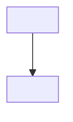

# Architektura: <system/komponent>

> Odwzorowuje REALNY byt, nie życzenie (ontologia §1).

## Diagram

## Komponenty
- <nazwa>: <rola, granice>

## Zależności
- <co od czego zależy; wersje/API jeśli istotne>

## Weryfikacja zgodności z kodem
- <skąd wiadomo, że diagram mówi prawdę — plik:linia / komenda>

## Powiązania
- parents: <id>
